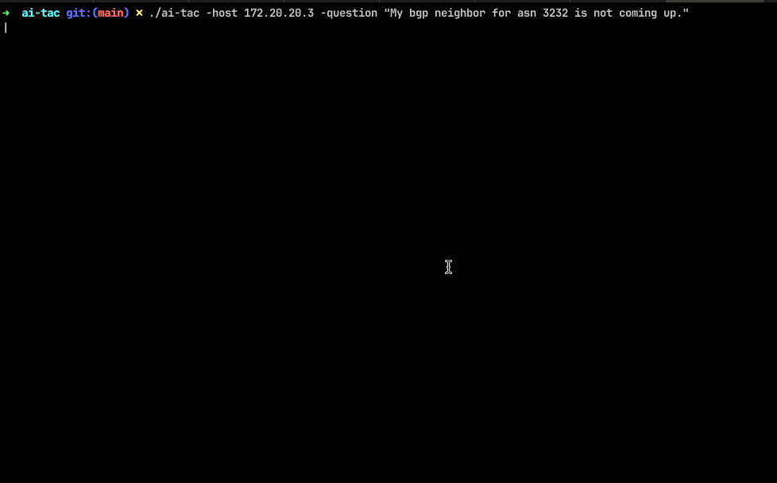
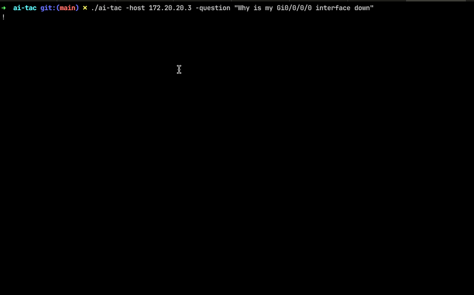

# AI TAC (Home Edition)

An AI-powered network troubleshooting assistant that combines GPT-4's analytical capabilities with automated network device interaction.






## Overview

AI TAC is a Go-based CLI tool that simulates a network TAC engineer by automatically executing diagnostic commands and analyzing their output. It uses GPT-4 to determine appropriate troubleshooting steps while maintaining strict safety measures to prevent any harmful commands from being executed.

## Features

- 🔒 Safe command execution with built-in protections
- 🤖 AI-powered troubleshooting flow
- 📝 Automated command execution on network devices
- 💾 Persistent troubleshooting history
- ✨ Formatted markdown output for results

## Prerequisites

- Go 1.x or higher
- OpenAI API key
- Network devices running Cisco IOS-XR
- Required Go packages (see Dependencies section)

## Installation

1. Clone the repository:
```bash
git clone [your-repository-url]
cd ai-tac
```

2. Install dependencies:
```bash
go mod download
```

3. Set up your OpenAI API key:
```bash
export OPENAI_API_KEY='your-api-key-here'
```

## Usage

Run the program with the following flags:

```bash
go run main.go -question "What is your troubleshooting question?" -host "device-ip-or-hostname"
```

### Example:
```bash
go run main.go -question "Why is interface GigabitEthernet0/0/0/0 down?" -host "192.168.1.1"
```

## How It Works

1. You provide a troubleshooting question and target device
2. GPT-4 suggests appropriate diagnostic commands
3. Commands are automatically executed on the target device
4. Results are analyzed by GPT-4
5. Process continues until the issue is identified or more information is needed
6. Final analysis is presented in formatted markdown

## Dependencies

- github.com/charmbracelet/glamour - For markdown rendering
- github.com/openai/openai-go - OpenAI API client
- github.com/scrapli/scrapligo - Network device automation
- Standard Go libraries

## Security Features

- Strict command filtering to prevent configuration changes
- No debug commands allowed
- Prevention of resource-intensive operations
- Authentication handling with proper credential management

## Configuration

The tool currently uses hardcoded credentials for device access:
- Username: clab
- Password: clab@123

For production use, you should modify these to use environment variables or a secure configuration file.

## Limitations

- Currently supports only Cisco IOS-XR devices
- Requires direct network access to devices
- Depends on GPT-4 API availability
- Not intended for production troubleshooting

## Contributing

Contributions are welcome! Some areas that could use improvement:

- Multi-vendor support
- Secure credentials management
- Command template library
- Result caching and optimization
- Test coverage

## Future Enhancements

- Support for additional network vendors
- Integration with existing monitoring systems
- Custom command template support
- Result database for knowledge building
- Enhanced security features

## Disclaimer

This tool is for educational and development purposes only. It should not be used as a replacement for professional network troubleshooting in production environments.

## Support

Srsly? There is none


